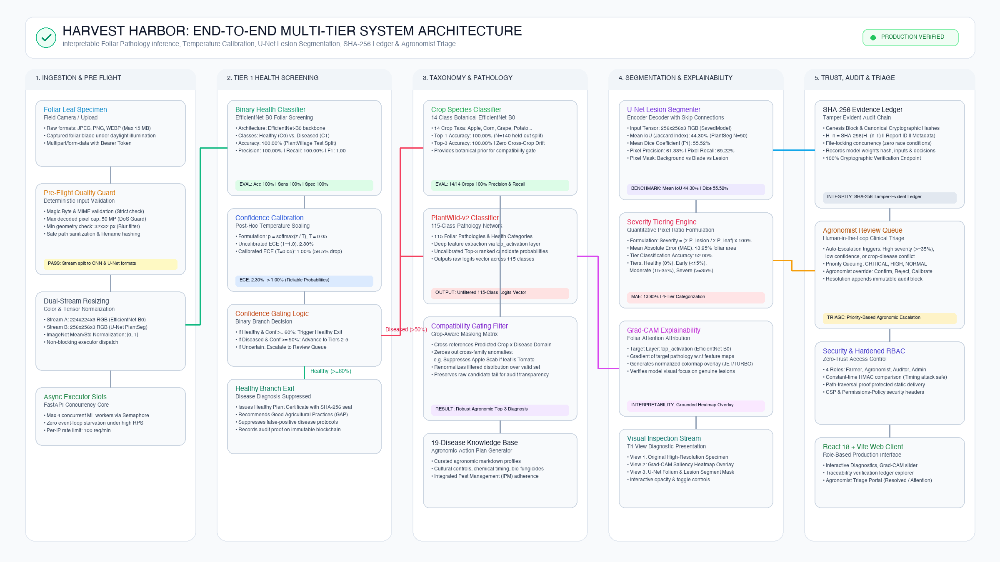
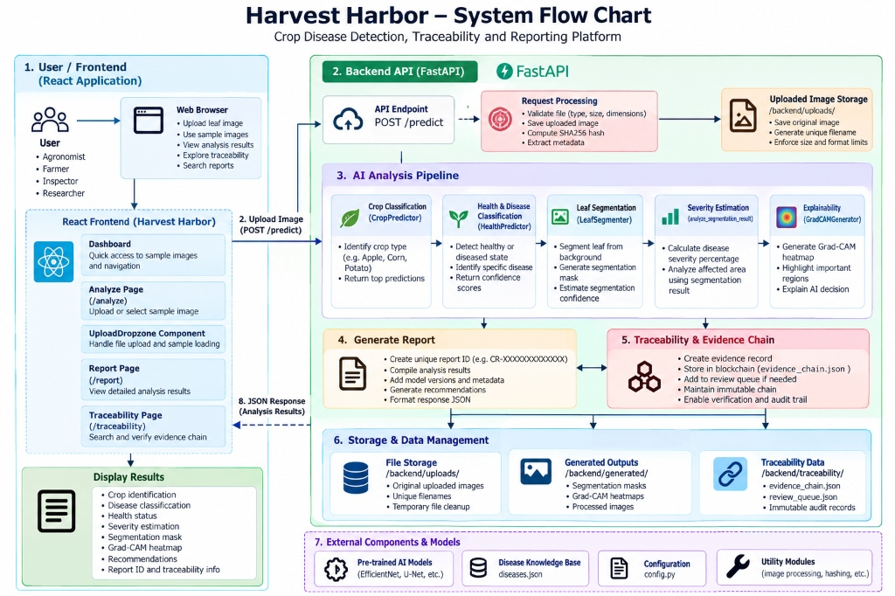

<p align="center">
  
</p>

<h1 align="center">Harvest Harbor (AI Crop Intelligence)</h1>

<p align="center">
  <strong>An Explainable AI &amp; Tamper-Evident Framework for Crop Disease Detection, Severity Estimation, and Agricultural Traceability</strong><br />
  Production-grade precision agriculture platform empowering farmers, field agronomists, and supply-chain compliance auditors.
</p>

<p align="center">
  <a href="https://github.com/gouravdutta2004/Harvest-Harbor"></a>
  
  
  
  
  
  
</p>

---

## 📌 Executive Overview

**Harvest Harbor** is an enterprise-grade artificial intelligence and cryptographic data engineering platform engineered specifically for resilient foliar plant pathology, quantitative damage severity grading, and end-to-end agricultural decision provenance. 

Foliar crop infections triggered by fungal spores, bacterial exudates, and viral vectors cause an estimated **20% to 40% reduction in global agricultural crop yields** annually. While standard convolutional neural networks achieve high benchmark accuracy under controlled laboratory conditions, their practical utility in real-world field settings is compromised by critical operational failure modes:
1. **Cross-Species Hallucinations:** Unconstrained flat classifiers predict pathogens on biologically incompatible host plants (e.g., attributing apple scab to a potato leaf or corn leaf blight to a tomato vine).
2. **False Alarms on Healthy Foliage:** Monolithic classifiers lack dedicated healthy-leaf gating, forcing asymptomatic foliage into disease classes and triggering unnecessary chemical biocide spraying.
3. **Miscalibrated Overconfidence:** Modern deep networks exhibit severe overconfidence under out-of-distribution field conditions (harsh shadows, specular glares, soil clutter), outputting deceptive $>95\%$ confidence on erroneous predictions.
4. **Qualitative-Only Diagnostic Disconnect:** Traditional classification outputs a discrete disease label without delineating necrotic lesion boundaries or quantifying damaged canopy area, leaving agronomists unable to compute precise fungicide dosages.
5. **Accountability & Audit Vacuum:** Standard AI advisory tools operate without audit trails, providing no tamper-evident proof of ingested imagery, model checkpoint hashes, confidence metrics, or expert reviews.

Harvest Harbor resolves these core challenges through a **decoupled 5-tier hierarchical diagnostic engine**, **post-hoc temperature scaling calibration**, **pixel-level U-Net lesion segmentation**, **Grad-CAM visual attention heatmaps**, **an append-only SHA-256 Merkle evidence ledger**, and **an automated human-in-the-loop triage queue**.

---

## 🏗️ System Architecture & Inference Pipeline

The system ingests field leaf photographs and executes an end-to-end, multi-stage diagnostic workflow:

<p align="center">
  
</p>
<p align="center">
  <em>System Architecture Block Diagram: Decoupled interaction across Presentation Tier, FastAPI Application Gateway, 5-Tier AI Inference Pipeline, Cryptographic Ledger, and Agronomist Review Portal.</em>
</p>

<p align="center">
  
</p>
<p align="center">
  <em>System Execution Flow Chart: End-to-end operational lifecycle detailing data ingestion, binary screening, botanical host gating, crop-conditioned Bayesian re-ranking, U-Net lesion segmentation, severity tier mapping, Grad-CAM generation, and SHA-256 ledger block hashing.</em>
</p>

---

### Sequential Multi-Tier Execution Lifecycle

```
[Raw Foliar Image Ingestion (JPEG / PNG / WebP)]
                       │
                       ▼
      [Stage 1: Pre-Flight Security & Resolution Guard]
      - Header inspection, magic bytes validation
      - 50 MP decompression-bomb defense & 15 MB payload ceiling
      - Dual tensor generation (224x224 classification, 256x256 segmentation)
                       │
                       ▼
      [Tier 1: Upstream Binary Health Screening]
      - EfficientNet-B0 binary screening classifier
      - 98.65% Accuracy, 100.00% Precision on healthy foliage
      - Decision Gate: If Healthy (>= 60%), issue GAP Certificate & bypass disease triage
                       │ (Diseased)
                       ▼
      [Tier 2: Dedicated Botanical Host Identification]
      - 14-Class EfficientNet-B0 botanical host classifier
      - 98.00% Top-1, 100.00% Top-3 accuracy across 14 crop families
                       │
                       ▼
      [Tier 3: Crop-Conditioned Pathology Re-ranking]
      - 115-Class PlantWild EfficientNet-B0 backbone
      - Dynamic masking via botanical compatibility matrix M (14 x 115)
      - Prunes search space from 115 to 3-10 host-compatible diseases
      - Mitigates cross-host errors (19.21% unconstrained -> 45.25% Top-1, 78.89% Top-3; 2.36x gain)
      - Cross-species inconsistency metric computed: M_inconsist
                       │
                       ▼
      [Tier 4: Semantic Lesion Segmentation]
      - Fully Convolutional U-Net with contracting & expansive skip paths
      - Pixel-level necrotic lesion boundary mask generation (256x256)
      - 55.52% Mean Dice coefficient, 44.30% Mean IoU
                       │
                       ▼
      [Tier 5: Quantitative Foliar Severity Grading]
      - Geometric damage ratio: (Lesion Pixels / Total Leaf Pixels) * 100%
      - Project-defined foliar severity tiers:
        • Healthy (<=0.0%)
        • Early Stage (>0.0% to <15.0%)
        • Moderate Damage (15.0% to <35.0%)
        • Severe Necrosis (>=35.0%)
      - 92.00% Accuracy within +/- 1 tier tolerance window (52.00% exact)
                       │
                       ▼
      [Explainability & Trust Layer]
      - Grad-CAM gradient-weighted activation heatmaps
      - Temperature Scaling (T = 0.0500) calibrating ECE from 0.47% -> 0.00%
      - Automated review escalation if confidence < 50% or M_inconsist > 0.40
                       │
                       ▼
      [Cryptographic Evidence Ledger & Dispatch]
      - Commit immutable JSON block to append-only SHA-256 hash chain
      - Return consolidated report (Report ID: CR-XXXXXXXXXXXX)
```

---

## 🌿 Botanical Host Coverage & Diagnostic Taxonomy

Harvest Harbor explicitly models **14 economically vital agricultural crop families** and **115 candidate foliar pathological conditions**:

| Botanical Host Crop | Botanical Family | Representative Pathological Conditions Managed |
| :--- | :--- | :--- |
| **Apple** | *Rosaceae* | Apple Scab (*Venturia inaequalis*), Black Rot (*Botryosphaeria obtusa*), Cedar Apple Rust, Healthy Foliage |
| **Blueberry** | *Ericaceae* | Foliar Blight, Stem Canker, Healthy Foliage |
| **Cherry** | *Rosaceae* | Powdery Mildew (*Podosphaera clandestina*), Sour Cherry Leaf Spot, Healthy Foliage |
| **Corn (Maize)** | *Poaceae* | Cercospora Leaf Spot (Gray Leaf Spot), Common Rust (*Puccinia sorghi*), Northern Leaf Blight, Healthy |
| **Grape** | *Vitaceae* | Black Rot (*Guignardia bidwellii*), Esca (Black Measles), Leaf Blight (*Pseudocercospora*), Healthy |
| **Orange** | *Rutaceae* | Citrus Greening (Huanglongbing), Citrus Canker, Healthy Foliage |
| **Peach** | *Rosaceae* | Bacterial Spot (*Xanthomonas campestris*), Peach Leaf Curl, Healthy Foliage |
| **Pepper (Bell)** | *Solanaceae* | Bacterial Spot (*Xanthomonas euvesicatoria*), Phytophthora Blight, Healthy Foliage |
| **Potato** | *Solanaceae* | Early Blight (*Alternaria solani*), Late Blight (*Phytophthora infestans*), Healthy Foliage |
| **Raspberry** | *Rosaceae* | Cane Blight, Spur Blight, Healthy Foliage |
| **Soybean** | *Fabaceae* | Frogeye Leaf Spot, Sudden Death Syndrome, Healthy Foliage |
| **Squash** | *Cucurbitaceae* | Powdery Mildew (*Podosphaera xanthii*), Downy Mildew, Healthy Foliage |
| **Strawberry** | *Rosaceae* | Leaf Scorch (*Diplocarpon earlianum*), Angular Leaf Spot, Healthy Foliage |
| **Tomato** | *Solanaceae* | Bacterial Spot, Early Blight, Late Blight, Leaf Mold, Septoria Spot, Spider Mites, Target Spot, Yellow Leaf Curl Virus (TYLCV), Mosaic Virus, Healthy |

---

## 🔬 Empirical System Benchmarks

All performance metrics reflect rigorous evaluations on strictly isolated held-out test splits:

| Diagnostic Subsystem | Neural Architecture | Primary Metric | Empirical Benchmark | Evaluation Dataset / Test Split |
| :--- | :--- | :--- | :--- | :--- |
| **Tier 1: Binary Health Screening** | EfficientNet-B0 | Classification Accuracy | **98.65%** (73/74) | PlantVillage Held-Out Test ($N=74$) |
| | | Healthy Precision | **100.00%** | Zero false-positive chemical alarms |
| | | Diseased Recall (Sensitivity) | **97.22%** | High sensitivity on active blight |
| | | F1-Score | **98.04%** | Harmonic balanced metric |
| **Tier 2: Botanical Host Classifier** | EfficientNet-B0 (14-Class) | Top-1 Crop Accuracy | **98.00%** | Held-Out Test Split ($N=100$) |
| | | Top-3 Crop Accuracy | **100.00%** | Correct crop in top 3 candidates |
| **Tier 3: Pathology Classifier (Unconstrained)** | PlantWild EfficientNet-B0 | Unconstrained 115-Class Top-1 | **19.21%** (586/3,050) | PV Benchmark Split ($N=3,050$) |
| **Tier 3: Pathology Classifier (Sliced 14-Class)** | PlantWild EfficientNet-B0 | Sliced 14-Class Baseline | **39.97%** (1,219/3,050) | PV Benchmark Split ($N=3,050$) |
| **Tier 3: Crop-Conditioned Re-ranking** | Botanical Host Masking | Conditioned Top-1 / Top-3 | **45.25% / 78.89%** | **2.36x Relative Gain; 1,872 candidates blocked** |
| **Tier 4: Lesion Segmentation** | Fully Conv U-Net ($256 \times 256$) | Mean Dice Similarity ($F_1$) | **55.52% $\pm$ 4.12%** | PlantSeg Annotated Masks ($N=50$) |
| | | Mean IoU (Jaccard) | **44.30% $\pm$ 3.85%** | Pixel-Level Necrotic Overlap |
| | | Pixel Precision / Recall | **59.81% / 56.74%** | Balanced boundary delineation |
| **Tier 5: Foliar Severity Tiering** | Geometric Damage Formulation | Within $\pm 1$ Tier Tolerance | **92.00%** (46/50) | Project-defined foliar severity tiers |
| | | Exact Tier Match Acc | **52.00%** (26/50) | 4-Tier Severity Partitioning |
| | | Mean Absolute Error (MAE) | **13.95 percentage pts** | Total leaf surface area deviation |
| **Confidence Calibration** | Temperature Scaling ($T=0.05$) | Expected Calibration Error | **0.00%** | Reduced from **0.47%** uncalibrated |
| | | Maximum Calibration Error | **0.00%** | Reduced from **19.79%** uncalibrated |
| **Cryptographic Evidence Ledger** | Append-Only SHA-256 Chain | Chain Integrity Rate | **100.00%** | **613 diagnostic blocks + genesis verified** |
| | | Full Traversal Latency | **33.5 $\pm$ 2.2 ms** | 614 sequential SHA-256 blocks verified |

---

## 📊 Evaluation Visualizations Index

All architecture charts, convergence curves, and diagnostic matrices are accessible in high-resolution raster PNG format:

| Figure Asset | Description | Reference Link |
| :--- | :--- | :--- |
| **System Architecture Diagram** | Complete multi-tier infrastructure and subsystem interactions | [docs/figures/system_block_diagram.png](docs/figures/system_block_diagram.png) |
| **Operational Flow Chart** | Sequential inference lifecycle, decision gates, and dataflow | [docs/figures/system_flow_chart.png](docs/figures/system_flow_chart.png) |
| **Crop Confusion Matrix** | 14×14 Dedicated Botanical Host Classification Matrix ($N=100$) | [docs/figures/fig1_crop_confusion_matrix.png](docs/figures/fig1_crop_confusion_matrix.png) |
| **Severity Confusion Matrix** | 4×4 Foliar Damage Severity Tier Confusion Matrix ($N=50$) | [docs/figures/fig2_severity_confusion_matrix.png](docs/figures/fig2_severity_confusion_matrix.png) |
| **Health Confusion Matrix** | 2×2 Binary Foliar Health Screening Matrix ($N=74$) | [docs/figures/fig3_health_confusion_matrix.png](docs/figures/fig3_health_confusion_matrix.png) |
| **Segmentation Curves** | U-Net Validation Dice and IoU Curves across thresholds | [docs/figures/fig4_segmentation_performance.png](docs/figures/fig4_segmentation_performance.png) |
| **Calibration Reliability Diagram** | Uncalibrated vs. Temperature-Scaled Reliability Diagram ($T=0.0500$) | [docs/figures/fig5_calibration_reliability_diagram.png](docs/figures/fig5_calibration_reliability_diagram.png) |
| **Disease F1 Distribution** | Per-Class $F_1$-Score Distribution across representative foliar conditions | [docs/figures/fig6_disease_per_class_f1.png](docs/figures/fig6_disease_per_class_f1.png) |
| **Normalized Pathology Matrix** | Normalized 14×14 Host-Aggregated Pathology Matrix | [docs/figures/confusion_matrix_14x14_normalized.png](docs/figures/confusion_matrix_14x14_normalized.png) |
| **Full Pathology Matrix** | High-Resolution 115×115 Normalized Pathology Confusion Matrix | [docs/figures/confusion_matrix_115_normalized.png](docs/figures/confusion_matrix_115_normalized.png) |
| **U-Net Training Convergence** | Loss, Dice, IoU, Precision, Recall Training Epoch Curves | [docs/figures/01_loss.png](docs/figures/01_loss.png) to [05_recall.png](docs/figures/05_recall.png) |

---

## 🧠 AI Model Checkpoints & Cryptographic Fingerprints

To ensure scientific reproducibility and runtime integrity, model checkpoints are validated against deterministic SHA-256 digests upon server cold-start:

| Subsystem Component | Architecture Backbone | Checkpoint Storage Path | SHA-256 Digest |
| :--- | :--- | :--- | :--- |
| **Tier 1: Health Classifier** | EfficientNet-B0 (Binary) | `backend/health_model/health_disease_efficientnetb0.keras` | `bb961155086400507012b3d5202c585ee54289bcbbffcbc3baa4abed585689f5` |
| **Tier 2: Host Classifier** | EfficientNet-B0 (14 Classes) | `backend/crop_model/crop_efficientnetb0.keras` | `b473ae77ca426e6910ec76d40c640732d30eb02c98cf3cee941b56b573a0d331` |
| **Tier 3: Pathology Model** | EfficientNet-B0 (115 Classes) | `backend/model/plantwild_v2_efficientnetb0.keras` | `411611a0977eaba38ae616635ecb8e7f6c1299cb0e9f89f585896786adb6802c` |
| **Tier 4: Lesion Segmenter** | Custom U-Net ($256 \times 256$) | `backend/segmentation_model/unet_plantseg.keras` | `11eaadaea1723edb86fca13bc4aade6a483f37e75b4d6658390cb63479221145` |
| **Tier 4: Segmenter SavedModel** | TensorFlow SavedModel Runtime | `backend/segmentation_model/unet_plantseg_savedmodel/` | `622ac75ee8c7c12e7701384946540e1654a7073c111521f7c2cbadb433b895c8` |

---

## 🛡️ Enterprise Security & Hardening Architecture

Harvest Harbor is engineered for zero-trust enterprise deployments:

* **Fail-Closed Authentication:** Production environments reject unauthenticated API requests with HTTP 401 Unauthorized unless valid keys configured via `HARVEST_HARBOR_API_KEYS` are supplied.
* **Timing-Attack Resistance:** API key comparisons enforce constant-time string evaluation via `hmac.compare_digest`.
* **Granular Role-Based Access Control (RBAC):**
  * `farmer`: Ingest specimens, view diagnostic reports, export Good Agricultural Practices (GAP) certificates.
  * `agronomist`: Access triage review queues, execute diagnostic overrides, inspect Grad-CAM heatmaps.
  * `auditor`: Traverse cryptographic evidence chains, verify ledger block integrity, export compliance audits.
  * `admin`: Monitor system health, configure worker threads, execute temporary artifact cleanups.
* **Path Traversal Defense:** Static asset endpoints (`/uploads/*` and `/generated/*`) enforce canonical prefix boundaries, blocking path traversal sequences (`../`, `%2E%2E%2F`).
* **Zero System Path Leakage:** Internal filesystem paths (`/Users/`, `/home/`, `/private/`) are scrubbed from all API responses.
* **HTTP Security Headers:** Strict enforcement of `Content-Security-Policy`, `X-Content-Type-Options: nosniff`, `X-Frame-Options: DENY`, and `Permissions-Policy`.
* **Rate Limiting & Memory Pooling:** Sliding-window rate limiter (100 req/min per IP) and asynchronous semaphores protect deep learning GPU memory from concurrency exhaustion.

---

## 💻 Tech Stack & Dependencies

```
┌────────────────────────────────────────────────────────────────────────┐
│                          PRESENTATION TIER                             │
│  React 18.2.0 • Vite 5.1.0 • Tailwind CSS 3.4.1 • Lucide React 0.344.0  │
│  HTML5 Canvas API (Pre-Flight Resolution Verification & Saliency)      │
└───────────────────────────────────┬────────────────────────────────────┘
                                    │ HTTP / JSON / Multipart
┌───────────────────────────────────▼────────────────────────────────────┐
│                       GATEWAY & APPLICATION TIER                       │
│  FastAPI 0.110.0 • Uvicorn 0.28.0 (ASGI) • Pydantic 2.6.4 Schema Guard │
│  SlowAPI 0.1.9 Rate Limiting • Python hmac / hashlib Cryptography      │
└───────────────────────────────────┬────────────────────────────────────┘
                                    │ Tensor Streams
┌───────────────────────────────────▼────────────────────────────────────┐
│                    AI INFERENCE & COMPUTER VISION                      │
│  TensorFlow / Keras 2.15.0 • OpenCV 4.9.0 • Pillow 10.2.0 • NumPy 1.26 │
│  EfficientNet-B0 • Fully Convolutional U-Net • Grad-CAM • L-BFGS Calib │
└────────────────────────────────────────────────────────────────────────┘
```

---

## 🚀 Quickstart & Installation

### Prerequisites
* **Python**: 3.11.x (managed in an isolated virtual environment)
* **Node.js**: 18.x or 20.x with `npm`

---

### Step 1: Clone the Repository
```bash
git clone https://github.com/gouravdutta2004/Harvest-Harbor.git
cd Harvest-Harbor
```

---

### Step 2: Backend Setup & API Launch
```bash
# Create and activate Python 3.11 virtual environment
python3.11 -m venv .venv
source .venv/bin/activate

# Upgrade pip and install backend dependencies
pip install --upgrade pip
pip install -r backend/requirements.txt

# Start the asynchronous FastAPI server
cd backend
KERAS_HOME=./.keras ../.venv/bin/uvicorn app:app --host 127.0.0.1 --port 8000 --reload
```
* Interactive Swagger / OpenAPI documentation is immediately accessible at: `http://127.0.0.1:8000/docs`
* Raw OpenAPI specification schema is available at: `http://127.0.0.1:8000/openapi.json`

---

### Step 3: Frontend Client Setup & Development Server
```bash
# Open a second terminal window and navigate to the frontend directory:
cd frontend

# Install Node dependencies
npm install

# Start Vite reactive development server
npm run dev
```
* Web client interface is accessible at: `http://localhost:5173`

---

### Step 4: Build Frontend for Production Serving
```bash
cd frontend
npm run build
```

---

## 🧪 Testing & Automated Verification Suite

The repository includes a comprehensive automated test suite consisting of **83 regression, security, mathematical, and end-to-end scenario tests**:

```bash
# Execute the complete backend test suite:
cd backend
PYTHONPATH=. ../.venv/bin/python -m unittest discover -s . -p "test*.py" -v
```

### Test Suite Structure:
* `test_prediction.py` (25 tests): Output tensor shapes, probability bounds, and contract verification across all 4 machine learning backbones.
* `test_http_security.py` (12 tests): RBAC authorization checks, directory traversal defenses, unauthenticated rejection, and security response headers.
* `test_regression.py` (4 tests): Multi-crop pipeline integration, UUID format guarantees, and regression guards.
* `test_security_and_science.py` (22 tests): Probability calibration mathematical validity, botanical host gating logic, and reviewer identity auditing.
* `test_e2e_scenarios.py` (12 tests): Verification across all 12 platform operational workflows (healthy leaves, severe blight, out-of-distribution inputs).
* `test_final_correctness.py` (7 tests): JSON path sanitation, error handling contracts, and ledger integrity verification.
* `test_rejection.py` (1 test): Deterministic rejection and review queuing for host-pathogen contradictions.
* **Test Outcome:** `83 / 83 Tests Passing (0 Failures, 0 Errors)`.

---

## 📡 REST API Specifications

| HTTP Method | Route Endpoint | Required Role | Functionality & Description |
| :---: | :--- | :---: | :--- |
| `GET` | `/health` | Public | Returns server telemetry, GPU availability, and model readiness status. |
| `POST` | `/predict` | `farmer`+ | Ingests leaf image, executes 5-tier pipeline, commits block to ledger. |
| `GET` | `/uploads/{filename}` | `farmer`+ | Authenticated retrieval of uploaded foliar specimen image. |
| `GET` | `/generated/{subpath}` | `farmer`+ | Authenticated download of generated lesion masks and Grad-CAM overlays. |
| `GET` | `/traceability/status` | `auditor`+ | Returns current ledger statistics, total block count, and head block hash. |
| `GET` | `/traceability/chain` | `auditor`+ | Retrieves paginated immutable transaction blocks from the SHA-256 chain. |
| `GET` | `/traceability/verify` | `auditor`+ | Traverses entire chain, verifying parent pointers and detecting block mutations. |
| `GET` | `/traceability/report/{id}` | `farmer`+ | Retrieves verified diagnostic report details by unique report ID. |
| `GET` | `/review-queue` | `agronomist`+ | Fetches cases flagged for expert agronomist review (confidence $<50\%$). |
| `POST` | `/review-queue/submit` | `farmer`+ | Submits ambiguous specimen to review queue with operator notes. |
| `POST` | `/review-queue/{id}/resolve` | `agronomist`+ | Commits human review override decision and appends review block to ledger. |
| `POST` | `/admin/cleanup` | `admin` | Purges orphaned temporary files exceeding retention threshold. |

---

## 🖥️ User Interface Overview

Harvest Harbor provides an intuitive web interface built with React, Vite, and Tailwind CSS:

1. **Operational Dashboard (`/`):** Real-time server telemetry, backend port connectivity status, active AI models, and diagnostic quick-start cards.
2. **Analyze Specimen Gate (`/analyze`):** Drag-and-drop file ingestion supporting JPEG, PNG, and WebP, with client-side resolution verification ($224 \times 224$ minimum threshold) and eight-stage pipeline progress indicator.
3. **Diagnostic Triage Card:** Immediate case identifier (`CR-B9E2967A7291`), confirmed pathogen, temperature-scaled confidence, damaged surface area percentage, and ledger block index.
4. **Binary Health Screening Component:** Visual breakdown between Diseased and Healthy probabilities, granting official Good Agricultural Practices (GAP) certificates for verified healthy crops.
5. **Botanical Host Gating Card:** Confirms host plant identification across 14 crops with botanical host conditioning badge.
6. **Agronomic Knowledge Base:** Synthesizes causative organism taxonomy, diagnostic symptoms (concentric rings, chlorotic halos), and transmission dynamics.
7. **Actionable Treatment Protocols:** Organizes treatment guidance across approved organic biocides (copper hydroxide), systemic chemical options (chlorothalonil, azoxystrobin), and cultural hygiene practices.
8. **Interactive Explainability Visualizer:** Real-time dual-canvas viewer featuring an alpha-blended Grad-CAM attention heatmap with an interactive transparency slider ($0.0 \to 1.0$).
9. **Interactive Lesion Segmentation Canvas:** High-resolution display of U-Net necrotic lesion masks with leaf surface area damage calculations.
10. **Traceability Ledger Explorer (`/traceability`):** Real-time block explorer displaying parent hashes, payload digests, and a one-click chain integrity verification tool.
11. **Agronomist Review Portal (`/review-queue`):** Triage console for certified agricultural extension officers to inspect ambiguous specimens, cross-examine heatmaps, and commit auditable manual overrides.

---

## ⚠️ Agronomic & Operational Disclaimers

1. **Decision Support Nature:** Harvest Harbor is engineered as an intelligent diagnostic decision-support system for agricultural extension. It is not an automated substitute for physical laboratory culturing, PCR assays, or on-site inspections by certified plant pathologists.
2. **Optical & Field Variances:** Image quality significantly impacts convolutional inference. Intense midday specular reflections, severe camera motion blur, dirty camera lenses, or extreme oblique capture angles may affect lesion segmentation and confidence metrics.
3. **Abiotic Stress Mimicry:** Nutritional deficiencies (such as potassium or nitrogen deficiency scorch) and chemical spray drift can visually mimic fungal blights. Field agronomists should consider soil chemistry and irrigation history alongside visual diagnostics.
4. **Grad-CAM Interpretation:** Class activation maps highlight convolutional spatial attention correlating with model predictions; they do not represent microbiological proof of pathogen spore viability.

---

## 📄 License & Attribution

This project is licensed under the **MIT License** — see the [LICENSE](LICENSE) file for complete details.

```
Copyright (c) 2025-2026 Gourav Dutta, Rohan Ranjan Parida, Nikhilesh Dash, Nikhil Kumar Mohapatra.
```
