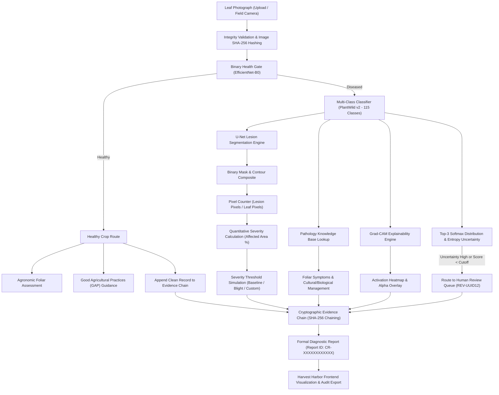

<p align="center">
  
</p>

<h1 align="center">Harvest Harbor (Crop Disease AI)</h1>

<p align="center">
  <strong>AI for Healthier Crops, Brighter Tomorrows</strong><br />
  Enterprise-Grade Crop Disease Assessment, Explainability (Grad-CAM), U-Net Lesion Segmentation, Quantitative Severity Analysis & Cryptographic Evidence Ledger
</p>

<p align="center">
  <a href="https://github.com/gouravdutta2004/Harvest-Harbor"></a>
  
  
  
  
  
  
</p>

---

## Overview

**Harvest Harbor** is an enterprise-grade, research-informed decision-support platform for agricultural intelligence. It provides deep-learning crop health screening, botanical species identification, multi-class disease diagnostics, visual explainability (Grad-CAM), lesion segmentation (U-Net), quantitative severity estimation, human-in-the-loop review queues, and a tamper-evident SHA-256 cryptographic evidence ledger.

Designed for agronomists, extension officers, and agricultural inspectors, Harvest Harbor transforms field leaf photography into actionable, auditable pathology dossiers with complete data provenance and zero simulated mock data.

> [!NOTE]
> **Tamper-Evident Evidence Chain**: Harvest Harbor utilizes an append-only, parent-hash-linked SHA-256 local ledger protected by inter-process file locks (`fcntl`). It provides cryptographic auditability for inspection reports without the overhead or latency of public distributed networks.

---

## Key Highlights

- **Multi-Stage Neural Pipeline**:
  - **Health Screening Gate**: EfficientNet-B0 binary classifier (`healthy` vs. `diseased`).
  - **Botanical Crop Identifier**: Dedicated 14-class crop species classifier.
  - **Pathology Classifier**: PlantWild v2 EfficientNet-B0 categorizing 115 disease classes with ranked Top-3 softmax predictions and entropy uncertainty metrics.
  - **Visual Explainability (Grad-CAM)**: Real-time gradient-weighted class activation mapping highlighting salient foliar regions.
  - **Lesion Segmentation (U-Net)**: Custom encoder-decoder network segmenting necrotic and chlorotic foliar tissue (production TensorFlow SavedModel runtime).
- **Quantitative Severity Calculation**: Pixel-accurate affected leaf area computation ($\text{Area \%} = \frac{\text{Lesion Pixels}}{\text{Leaf Pixels}} \times 100$) paired with an interactive Agronomic Severity Threshold Simulator.
- **Human Review Queue**: Built-in review queue for low-confidence or high-uncertainty detections with globally unique UUIDs (`REV-XXXXXXXXXXXX`), reviewer notes, and resolution actions.
- **Cryptographic Provenance**: Every diagnostic report receives a unique ID (`CR-XXXXXXXXXXXX`), image SHA-256 checksum, model execution signatures, and is anchored to an immutable local hash-chain.
- **Role-Based Access Governance (RBAC)**: Fine-grained access control tailored for Farmers, Agronomists, Supply Chain Auditors, and System Administrators with instant persona switching in the UI.
- **100% Passing Test Suite**: 79 comprehensive tests spanning regression, security, access control, input validation, and end-to-end pipelines.

---

## Table of Contents

- [System Architecture](#system-architecture)
- [Diagnostic Pipeline Workflow](#diagnostic-pipeline-workflow)
- [AI Model Zoo & Artifact Fingerprints](#ai-model-zoo--artifact-fingerprints)
- [Frontend Experience](#frontend-experience)
- [REST API Specifications](#rest-api-specifications)
- [Authentication & Access Governance (RBAC)](#authentication--access-governance-rbac)
- [Setup & Installation](#setup--installation)
- [Testing & Quality Assurance](#testing--quality-assurance)
- [Technical Documentation Suite (docs/)](#technical-documentation-suite-docs)
- [Repository Structure](#repository-structure)
- [Scientific & Agronomic Disclaimers](#scientific--agronomic-disclaimers)
- [License](#license)

---

## System Architecture

Harvest Harbor is architected with a decoupled frontend client and a high-performance RESTful Python backend:

```
┌────────────────────────────────────────────────────────────────────────┐
│               HARVEST HARBOR FRONTEND (React 18 + Vite)                │
│  - Crop Intelligence Dashboard (Live Evidence Chain Metrics & Activity)│
│  - Diagnostic Workspace (Dropzone, Camera Capture, 4-Crop Field Suite) │
│  - Multi-Branch Results (Grad-CAM Slider, U-Net Mask, Knowledge Base)  │
│  - Severity Threshold Simulator (Presets + Project-Defined Cutoffs)    │
│  - Human Review Queue (Triaging, UUID Tracking, Resolution Notes)      │
│  - AI-Assisted Assessment Report & JSON Audit Dossier Export          │
│  - Evidence Chain Explorer & 1-Click Verification                      │
│  - Role-Based Access Governance (Farmer, Agronomist, Auditor, Admin)  │
└───────────────────────────────────┬────────────────────────────────────┘
                                    │ HTTP REST / JSON / Multipart
                                    ▼
┌────────────────────────────────────────────────────────────────────────┐
│                   FASTAPI BACKEND (Python 3.11+)                       │
│  ├── Health Screening: EfficientNet-B0 (Binary Health Classifier)      │
│  ├── Botanical Classifier: EfficientNet-B0 (14 Crop Species)           │
│  ├── Multi-Class Classifier: PlantWild v2 (115 Disease Categories)    │
│  ├── Visual Explainability: Grad-CAM (Convolutional Gradients)         │
│  ├── Lesion Segmentation: U-Net (TensorFlow SavedModel Runtime)        │
│  ├── Quantitative Severity Engine: Leaf vs. Disease Pixel Geometry     │
│  ├── Human Review Queue: Thread-safe, UUID-indexed Resolution Engine   │
│  ├── Pathology Knowledge Base: Etiology & Management Guidance          │
│  └── Evidence Chain: Local SHA-256 Tamper-Evident Hash Chain           │
└────────────────────────────────────────────────────────────────────────┘
```

---

## Diagnostic Pipeline Workflow



---

## AI Model Zoo & Artifact Fingerprints

To ensure model integrity and prevent unauthorized parameter drift, all neural network weights are cryptographically fingerprinted using SHA-256. The system supports dual formats: native Keras 3 (`.keras`), TensorFlow 2.15 compatibility weights (`.h5`), and the production TensorFlow `SavedModel` runtime.

| Model Role | Architecture | Format | File Path | SHA-256 Checksum |
| :--- | :--- | :--- | :--- | :--- |
| **Disease Classifier** | EfficientNet-B0 (115 Classes) | `.keras` | `backend/model/plantwild_v2_efficientnetb0.keras` | `411611a0977eaba38ae616635ecb8e7f6c1299cb0e9f89f585896786adb6802c` |
| **Disease Classifier (Compat)** | EfficientNet-B0 (115 Classes) | `.h5` | `backend/model/plantwild_v2_efficientnetb0.h5` | `e305ecae717818dcb4401143f362d88fd9b017daa7f57b5488f7918dd90f6ff4` |
| **Botanical Crop ID** | EfficientNet-B0 (14 Classes) | `.keras` | `backend/crop_model/crop_efficientnetb0.keras` | `b473ae77ca426e6910ec76d40c640732d30eb02c98cf3cee941b56b573a0d331` |
| **Botanical Crop ID (Compat)**| EfficientNet-B0 (14 Classes) | `.h5` | `backend/crop_model/crop_efficientnetb0.h5` | `c250b1f5504f4326e51fdc781c995d323931db255130964c2f98317a95cb2646` |
| **Health Screening Gate** | EfficientNet-B0 (Binary) | `.keras` | `backend/health_model/health_disease_efficientnetb0.keras` | `bb961155086400507012b3d5202c585ee54289bcbbffcbc3baa4abed585689f5` |
| **Health Screening (Compat)** | EfficientNet-B0 (Binary) | `.h5` | `backend/health_model/health_disease_efficientnetb0.h5` | `bf459916d7837a9efe4c6100e2849d16ceaeeb0b68e57ecc5e56c0b8682fb097` |
| **Lesion Segmentation (Prod)**| Custom U-Net | `SavedModel` | `backend/segmentation_model/unet_plantseg_savedmodel/` | `622ac75ee8c7c12e7701384946540e1654a7073c111521f7c2cbadb433b895c8` |
| **Lesion Segmentation (Src)** | Custom U-Net | `.keras` | `backend/segmentation_model/unet_plantseg.keras` | `11eaadaea1723edb86fca13bc4aade6a483f37e75b4d6658390cb63479221145` |

> [!IMPORTANT]
> The authoritative production runtime for foliar lesion segmentation is the TensorFlow `SavedModel` directory (`backend/segmentation_model/unet_plantseg_savedmodel/`). Input tensor shape: `(None, 256, 256, 3)` &rarr; Output tensor shape: `(None, 256, 256, 1)`.

---

## Frontend Experience

The Harvest Harbor frontend is a responsive, single-page application built with React 18, Tailwind CSS, and Vite.

### Core Application Views

| Page | Path | Description |
| :--- | :--- | :--- |
| **Dashboard** | `/` | Real-time platform metrics, health-to-disease ratios, active model status, and chronological diagnostic activity feed. |
| **Diagnostic Lab** | `/analyze` | Primary inference workspace with drag-and-drop file upload, field camera trigger, 4 sample test leaves, interactive Grad-CAM opacity slider, U-Net mask visualizer, and dynamic severity simulator. |
| **Review Queue** | `/reviews` | Human-in-the-loop triaging dashboard. Displays pending reviews with globally unique IDs (`REV-XXXXXXXXXXXX`), confidence levels, uncertainty flags, inspector notes, and resolution actions. |
| **Diagnostic Reports** | `/report` | Formal diagnostic dossier viewer. Features report search by ID (`CR-...`), persistent authenticated asset reconstruction, `@media print` styling, and full JSON audit export. |
| **Evidence Ledger** | `/traceability` | Cryptographic audit explorer. Search records by Report ID or Image SHA-256, and trigger 1-click end-to-end mathematical chain verification. |
| **Platform Info** | `/about` | Technical architecture walkthrough, dataset provenance details, operational pillars, and scientific disclaimers. |

### Diagnostic Severity Threshold Presets

Agronomic action thresholds vary between pathogens and field conditions. The built-in simulator provides preset and custom models:

| Threshold Preset | Early Stage | Moderate Stage | Severe Stage | Primary Field Use Case |
| :--- | :--- | :--- | :--- | :--- |
| **Standard Baseline** | $< 15\%$ | $15\% - 35\%$ | $\ge 35\%$ | General foliar pathogen assessment |
| **High-Risk Blight / Rust** | $< 5\%$ | $5\% - 15\%$ | $\ge 15\%$ | Rapidly spreading aggressive foliar blights |
| **High-Tolerance Canopy** | $< 20\%$ | $20\% - 45\%$ | $\ge 45\%$ | Cosmetic leaf spot or mature canopy management |
| **Custom Agronomist Sliders** | Dynamic (2–25%) | Dynamic (10–60%) | Dynamic | User-calibrated custom thresholds |

---

## REST API Specifications

The FastAPI backend runs on `http://127.0.0.1:8000`. Interactive documentation is available via Swagger at `/docs` and ReDoc at `/redoc`.

| Method | Endpoint | Auth | Description | Key Response Fields |
| :--- | :--- | :--- | :--- | :--- |
| `GET` | `/` | Public | System status & loaded models | `status`, `models_loaded`, `version` |
| `GET` | `/health` | Public | Service liveness & readiness check | `status`, `models`, `knowledge_base_size` |
| `POST`| `/predict` | Required | Full end-to-end diagnostic pipeline | `report_id`, `health_prediction`, `disease_analysis`, `segmentation`, `severity`, `traceability` |
| `GET` | `/reviews` | Required | Retrieve all review queue items | `reviews`: Array of pending and resolved reviews |
| `POST`| `/reviews/{review_id}/resolve` | Required | Resolve a review queue item | `status`, `review_id`, `report_id`, `resolved_at` |
| `GET` | `/traceability/status` | Public | Summary of cryptographic chain | `chain_valid`, `total_blocks`, `latest_hash` |
| `GET` | `/traceability/verify` | Public | Live cryptographic chain verification | `valid`, `checked_blocks`, `message` |
| `GET` | `/traceability/chain` | Public | Complete serialized evidence ledger | `chain`: Array of all chained blocks |
| `GET` | `/traceability/report/{id}`| Public | Specific report metadata lookup | `report`: Record matching report ID |
| `GET` | `/uploads/{filename}` | Authenticated | Original leaf photograph delivery | Image binary |
| `GET` | `/generated/{kind}/{file}`| Authenticated | Grad-CAM overlays & U-Net masks | Image binary |

---

## Authentication & Access Governance (RBAC)

Harvest Harbor enforces fine-grained Role-Based Access Control on diagnostic and review endpoints. Authentication is supported via `Authorization: Bearer <token>` or `X-API-Key: <token>` headers. Query-token authentication is strictly forbidden to prevent credential leakage in HTTP access logs.

### Built-in Personas & Development Keys

In development mode, the platform provides pre-configured personas with default keys:

| Persona / Role | Default Dev Key | Permissions & Capabilities |
| :--- | :--- | :--- |
| **Field Agronomist** *(Default)* | `dev-agronomist-key` | Full diagnostic analysis, U-Net mask inspection, threshold calibration, and human review resolution |
| **Field Farmer** | `dev-farmer-key` | Standard crop scanning, assessment report viewing, and printable GAP certificates |
| **Supply Chain Auditor** | `dev-auditor-key` | Cryptographic evidence chain inspection, SHA-256 verification, and JSON audit dossier export |
| **Enterprise Admin** | `dev-admin-key` | Full administrative access, custom credentials, and endpoint configuration |

> [!TIP]
> **1-Click Persona Switching**: You can switch between active roles or configure custom credentials directly from the user interface using the **Role Badge** button in the Topbar (top-right) or Sidebar (bottom).

---

## Setup & Installation

### System Prerequisites
- **Python**: Version `3.11` recommended (`3.10+` supported)
- **Node.js**: Version `18.0` or higher (`npm` included)
- **Operating System**: macOS, Linux, or Windows (WSL recommended)

---

### Step 1: Clone Repository & Backend Setup

```bash
# Clone the repository
git clone https://github.com/gouravdutta2004/Harvest-Harbor.git
cd Harvest-Harbor

# Create and activate Python virtual environment
python3 -m venv .venv
source .venv/bin/activate       # On Windows: .venv\Scripts\activate

# Install backend dependencies
pip install -r backend/requirements.txt

# Configure backend environment
cp backend/.env.example backend/.env
```

---

### Step 2: Launch the FastAPI Backend Server

```bash
cd backend
python -m uvicorn app:app --host 127.0.0.1 --port 8000 --reload
```

- API Base URL: `http://127.0.0.1:8000`
- Swagger Interactive Docs: `http://127.0.0.1:8000/docs`
- ReDoc Documentation: `http://127.0.0.1:8000/redoc`

---

### Step 3: Launch the Frontend Application

Open a second terminal window:

```bash
cd Harvest-Harbor/frontend

# Install dependencies (only required on first setup)
npm install

# Configure frontend environment
cp .env.example .env

# Start Vite development server
npm run dev
```

- Web Application URL: `http://localhost:5173`

---

## Testing & Quality Assurance

Harvest Harbor maintains a **100% passing test suite** with 79 comprehensive tests covering:
- Binary health screening & multi-class disease predictions
- U-Net lesion segmentation inference & pixel metrics
- Quantitative severity boundary conditions
- Human review queue concurrency, UUID uniqueness, and resolution
- Cryptographic evidence chain integrity, tampering rejection, and parent-hash verification
- HTTP security headers, RBAC authentication gates, and path-traversal prevention

### Running the Test Suite

```bash
# Activate the virtual environment
source .venv/bin/activate

# Execute all 79 backend tests:
cd backend
python -m unittest discover -s . -p "test_*.py" -v
```

Expected output:
```text
----------------------------------------------------------------------
Ran 79 tests in 41.163s

OK
```

### Running End-to-End Scenarios

```bash
cd backend
python -m unittest test_e2e_scenarios.py -v
```

### Frontend Build Verification

```bash
cd frontend
npm run build
```

---

## Technical Documentation Suite (docs/)

Deep-dive architectural specifications, model lineage, and operations manuals are available in the [`docs/`](docs/) directory:

- 📖 **[System Architecture & Specification](docs/ARCHITECTURE.md)**: Mathematical formulations, neural pipelines, leaf geometry, and blockchain concurrency.
- 🔌 **[REST API Reference & Integration Guide](docs/API_REFERENCE.md)**: Full endpoint schemas, request/response contracts, and error handling.
- 🔬 **[Model Lineage & Scientific Provenance](docs/MODEL_LINEAGE.md)**: Model SHA-256 fingerprint registry, dataset sources, temperature scaling ($T = 0.0500$), and scientific limitations.
- 🚀 **[Deployment & Operations Manual](docs/DEPLOYMENT_AND_OPERATIONS.md)**: Production systemd setup, Nginx reverse proxy, and ledger maintenance.

---

## Repository Structure

```
Harvest-Harbor/
├── README.md                                  # Platform Documentation
├── LICENSE                                    # MIT License
├── package.json                               # Workspace Root Package Configuration
├── requirements.txt                           # Root Python Requirements Reference
├── .gitignore                                 # Production Git Exclusion Rules
├── .env.example                               # Root Environment Template
│
├── docs/                                      # Technical Documentation Suite
│   ├── README.md                              # Documentation Index
│   ├── ARCHITECTURE.md                        # Architecture & Mathematical Formulations
│   ├── API_REFERENCE.md                       # Complete REST API Specifications
│   ├── MODEL_LINEAGE.md                       # Neural Weight Provenance & Hashes
│   ├── DEPLOYMENT_AND_OPERATIONS.md           # Production Deployment Guide
│   └── assets/                                # Platform Artwork & Official Logo
│       ├── logo.png
│       └── logo.jpg
│
├── backend/                                   # FastAPI Backend Application
│   ├── app.py                                 # Primary REST Server & Static Asset Mounts
│   ├── auth.py                                # Role-Based Access Control (RBAC) & Header Security
│   ├── config.py                              # Central System & Pipeline Settings
│   ├── predictor.py                           # PlantWild v2 115-Class Disease Classifier
│   ├── crop_classifier.py                     # 14-Class Botanical Species Classifier
│   ├── health_predictor.py                    # Binary Health Screening Classifier
│   ├── gradcam.py                             # Grad-CAM Convolutional Gradient Generator
│   ├── segmentation.py                        # U-Net Lesion Segmentation Inference Engine
│   ├── severity.py                            # Quantitative Severity & Area Calculation
│   ├── review_queue.py                        # Human Review Queue & Transactional Locks
│   ├── utils.py                               # Image Normalization & Geometry Utilities
│   ├── requirements.txt                       # Backend Python Dependencies
│   │
│   ├── model/                                 # 115-Class Weights & Labels
│   │   ├── plantwild_v2_efficientnetb0.keras
│   │   ├── plantwild_v2_efficientnetb0.h5
│   │   └── plantwild_v2_class_names.json
│   │
│   ├── crop_model/                            # 14-Class Crop Identification Weights
│   │   ├── crop_efficientnetb0.keras
│   │   ├── crop_efficientnetb0.h5
│   │   └── crop_class_names.json
│   │
│   ├── health_model/                          # Binary Health Classifier Weights
│   │   ├── health_disease_efficientnetb0.keras
│   │   ├── health_disease_efficientnetb0.h5
│   │   └── health_disease_class_names.json
│   │
│   ├── segmentation_model/                    # Production U-Net Segmentation Engine
│   │   ├── unet_plantseg_savedmodel/          # Authoritative TensorFlow SavedModel
│   │   └── unet_plantseg.keras                # Source Training Keras Artifact
│   │
│   ├── disease_knowledge/                     # Curated Agronomic Knowledge Base
│   │   └── diseases.json                      # Pathogen Etiology, Symptoms & Guidance
│   │
│   ├── traceability/                          # Cryptographic Evidence Ledger
│   │   ├── blockchain.py                      # SHA-256 Ledger Implementation
│   │   ├── evidence.py                        # Evidence Record Builder
│   │   └── evidence_chain.json                # Local Ledger Storage
│   │
│   ├── generated/                             # Generated Visual Artifacts (Preserved via .gitkeep)
│   │   ├── gradcam/
│   │   └── segmentation/
│   │
│   ├── uploads/                               # Persistent Ingested Leaf Images (Preserved via .gitkeep)
│   │
│   ├── test_e2e_scenarios.py                  # End-to-End Scenario Test Suite
│   ├── test_final_correctness.py              # System Correctness & Data Pipeline Tests
│   ├── test_http_security.py                  # Access Control, RBAC & Path Traversal Tests
│   ├── test_prediction.py                     # AI Prediction & Model Inference Tests
│   ├── test_regression.py                     # Review Queue & System Regression Tests
│   ├── test_rejection.py                      # Input Validation & Corrupt Image Tests
│   └── test_security_and_science.py           # Scientific Metrics & Ledger Security Tests
│
├── frontend/                                  # React 18 Single-Page Application
│   ├── index.html                             # Application Entry Shell
│   ├── package.json                           # Frontend Dependencies & Scripts
│   ├── vite.config.js                         # Vite Bundler Configuration
│   ├── tailwind.config.js                     # Tailored AgTech Theme Configuration
│   │
│   ├── public/                                # Static Assets
│   │   ├── logo.png                           # Official Platform Logo
│   │   ├── favicon.png                        # Browser Favicon
│   │   └── samples/                           # Field Test Leaves
│   │
│   └── src/                                   # Frontend React Source
│       ├── main.jsx                           # Application Mount Point
│       ├── App.jsx                            # Router & Master Layout
│       ├── context/                           # Auth & RBAC State Provider
│       ├── services/                          # API Client & Asset Resolvers
│       ├── components/                        # Reusable AgTech UI Components
│       └── pages/                             # Dashboard, Analyze, Report, Reviews, Traceability
│
└── test_images/                               # Reference Diagnostic Test Leaves
```

---

## Scientific & Agronomic Disclaimers

1. **Decision Support Only**: Harvest Harbor is developed as an AI-powered diagnostic assistant and educational tool. Neural network predictions, segmentation masks, and severity estimations are decision-support aids and should not be treated as definitive laboratory phytopathology diagnoses.
2. **Field Verification**: Always verify critical crop pathology determinations with certified agronomists or local university agricultural extension services prior to applying chemical interventions, fungicides, or pesticides.
3. **Threshold Calibration**: The project-defined severity tiers (Healthy $\le 0\%$, Early $< 15\%$, Moderate $15\% - 35\%$, Severe $\ge 35\%$) and preset profiles are illustrative models designed to demonstrate decision-support workflows. They do not constitute regulatory or universally certified Economic Injury Levels (EIL).
4. **Data Privacy**: All image analysis and evidence hashing are performed locally on the host server. Uploaded photographs and generated diagnostic artifacts are stored locally in accordance with your host deployment configuration.

---

## License

This project is licensed under the **MIT License** — see the [LICENSE](LICENSE) file for complete details.
